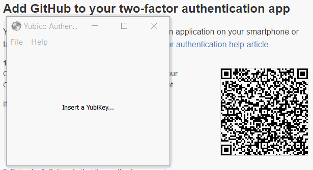

== Yubico Authenticator
image:https://travis-ci.org/tycho/yubioath-desktop.svg?branch=develop["Build Status", link="https://travis-ci.org/tycho/yubioath-desktop"]

The Yubico Authenticator is a graphical desktop tool and command line tool for
generating Open AuTHentication (OATH) event-based HOTP and time-based TOTP
one-time password codes, with the help of a YubiKey that protects the shared
secrets.

=== Graphical interface

=== Command line interface
  $ yubioath --help
  Usage: yubioath [OPTIONS] COMMAND [ARGS]...

  Commands:
    delete    Deletes a credential from the YubiKey.
    gui       Launches the Yubico Authenticator graphical interface.
    password  Manage the password used to protect access to the YubiKey.
    put       Stores a new OATH credential in the YubiKey.
    reset     Deletes all stored OATH credentials from the YubiKey.
    show      Print one or more codes from a YubiKey.

=== Installation
The recommended way to install this software including dependencies is by using
the provided precompiled binaries for your platform. For Windows and OS X (10.7
and above), there are installers available for download
https://developers.yubico.com/yubioath-desktop/Releases/[here]. For Ubuntu we
have a custom PPA with a package for it
https://launchpad.net/~yubico/+archive/ubuntu/stable[here].

==== Using pip
You can also install this project using pip, however the dependencies may
require additional tools to build.  When installing from pip, you can choose
whether or not you wish to install the graphical application, just the command
line tool, or just the python library. You do so as follows:

  $ pip install yubioath-desktop[cli,gui]  # This will install everything.
  $ pip install yubioath-desktop  # This installs only the library.

If you run into problems during installation it will likely be with one of the
dependencies, such as PyQt5 or pyscard. Please see the relevant documentation
for installing each project, provided by those projects.

=== Supported devices
Usage of this software requires a compatible YubiKey device. Yubico
Authenticator is capable of provisioning and using credentials via the OATH
functionality of the YubiKey NEO and YubiKey 4. To use this functionality your
YubiKey must have the CCID mode enabled, which can be done by using the
https://developers.yubico.com/yubikey-neo-manager/[YubiKey NEO Manager].

==== Detecting the device when using CCID
Under Linux and OS X this application uses libccid to communicate with the
YubiKey. This library requires that each card reader used is listed in its
configuration file, else the device will not be detected ("Insert a YubiKey..."
will be displayed even though a YubiKey is present). To ensure that your
libccid configuration contains all necessary entries you can run one of the two
files locates in the resources directory of this repository, linux-patch-ccid
or osx-patch-ccid, depending on your OS. You will need to run these scripts as
root. If installing the OS X version from the binary installer, this script
will be run automatically for you.

NOTE: You may have to reboot your computer for the change to the libccid
configuration to take effect!

=== Dependencies
Yubico Authenticator requires click, PyQt5, yubikey-personalization, pyscard,
and PyCrypto.

=== Working with the source code repository
To work with the source code repository, if you wish to build your own release
or contribute pull requests, follow these steps to set up your environment. If
you just wish to install the application use the pre-build binaries or the
source release packages. This project is developed on a Debian based system,
other OSes may not be supported for development.

==== Installing the dependencies
Make sure to install the needed dependencies:

  sudo apt-get install python-setuptools python-crypto python-pyscard \
      python-pyside pyside-tools python-click pcscd

==== Check out the code
Run these commands to check out the source code:

  git clone --recursive https://github.com/Yubico/yubioath-desktop.git

==== Install the project using pip
Install the project from the source code repository, in development mode:

  cd yubioath-desktop  # cd into the git repository
  python setup.py qt_resources  # Generate image resources (requires pyside-tools).
  pip install -e .[cli,gui]  # Install the code in developer mode, using pip.

You can now run the yubioath and yubioath-gui binaries, and anychanges you make
to the code should be reflected in these commands. To remove the installation, run:

  pip uninstall yubioath-desktop

==== Build a source release
To build a source release tar ball, run this command:

  python setup.py sdist

The resulting build will be created in the dist/ subdirectory.

=== License
Yubico Authenticator is licensed under GPLv3+, see COPYING for details.

Entypo pictograms by Daniel Bruce - www.entypo.com
